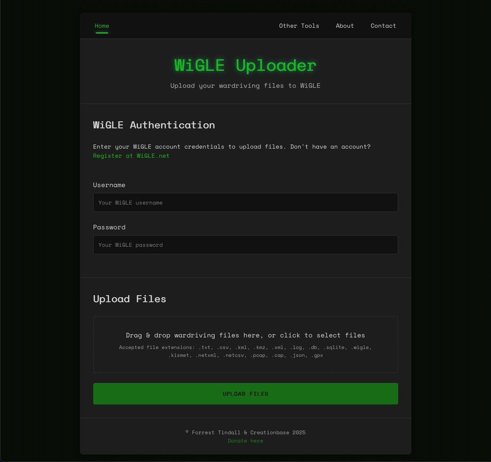

# WiGLEUploader

A sleek, modern dark-mode web application for uploading wardriving files to the WiGLE database.

## 🌐 Live Website

**[https://wigleuploader.net](https://wigleuploader.net)**

Use WigleUploader directly from your browser without installation! The web application is hosted at [wigleuploader.net](https://wigleuploader.net) and is free to use for the wardriving community.

## 🚀 Features

- **Drag & Drop Interface**: Easily upload files with a modern drag and drop interface
- **Batch Uploads**: Upload multiple wardriving files simultaneously
- **Format Support**: Compatible with all major wardriving file formats:
  - DStumbler
  - G-Mon
  - inSSIDer
  - Kismac
  - Kismet
  - MacStumbler
  - NetStumbler
  - Pocket Warrior
  - Wardrive-Android
  - WiFiFoFum
  - WiFi-Where
  - WiGLE WiFi Wardriving
  - Apple consolidated DB
- **Secure Authentication**: Simple and secure WiGLE account authentication
- **Retro-Modern UI**: Sleek dark mode interface with a retro computer aesthetic
- **Responsive Design**: Works on desktop and mobile devices
- **Image Stats Generator**: Create shareable images with your wardriving statistics
- **Heatmap Route Planner**: Visualize your wardriving data with an interactive heatmap

## 📸 Screenshots

## 🌐 API Integration

WigleUploader integrates with the WiGLE API to upload wardriving files. You'll need a WiGLE account to use this application. [Register at WiGLE.net](https://wigle.net/register) if you don't have an account.

## 🗺️ Heatmap Route Planner

The Route Planner feature allows you to:
- Visualize your wardriving data as an interactive heatmap
- See where you've been and identify areas you haven't covered
- Plan efficient routes for future wardriving sessions
- Toggle between map views with a custom dark mode style
- Use your current location to start planning from where you are

## 📊 Image Stats Generator

Create beautiful, shareable images with your wardriving statistics:
- Total networks discovered
- Breakdown by network type
- Personalized with your WiGLE username
- Perfect for social media sharing
- Custom styling options

## 🤝 Contributing

Contributions are welcome! Please feel free to submit a Pull Request.

1. Fork the repository
2. Create your feature branch (`git checkout -b feature/amazing-feature`)
3. Commit your changes (`git commit -m 'Add some amazing feature'`)
4. Push to the branch (`git push origin feature/amazing-feature`)
5. Open a Pull Request

## 🙏 Acknowledgements

- [WiGLE](https://wigle.net) for providing the API and database for wireless network mapping
- [React](https://reactjs.org/) for the UI library
- [react-dropzone](https://react-dropzone.js.org/) for the file upload functionality
- [Geist Mono](https://vercel.com/font) for the beautiful monospace font
- [Google Maps API](https://developers.google.com/maps) for the mapping functionality

## 📬 Contact

- Website: [https://4est.io](https://4est.io)
- Project Repository: [https://github.com/forresttindall/WiGLEUploader](https://github.com/forresttindall/WiGLEUploader)
- Email: [contact@4est.io](mailto:forrest.tindall@gmail.com)

---

Made with 👹 for the wardriving community
